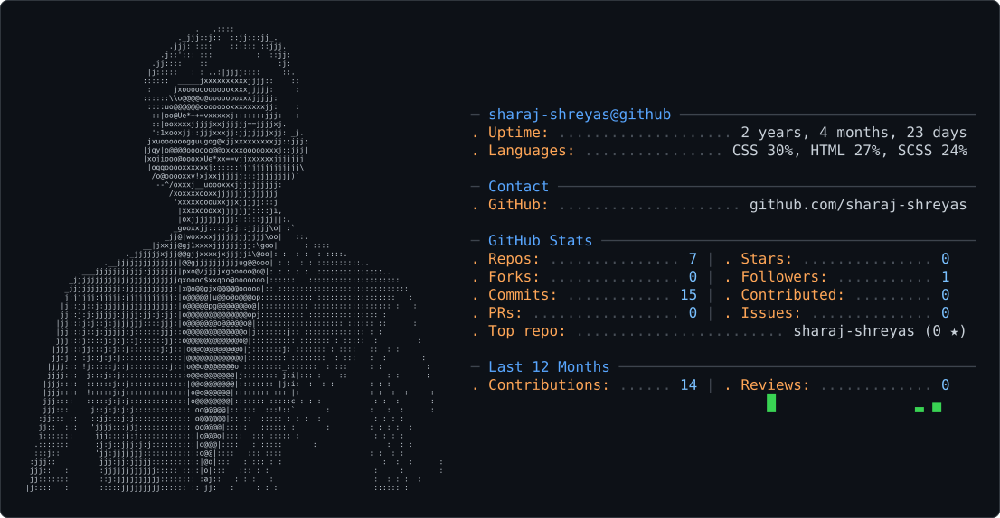

<picture>
  <source media="(prefers-color-scheme: dark)" srcset="dark_mode.svg" />
  <source media="(prefers-color-scheme: light)" srcset="light_mode.svg" />
  
</picture>
## ❯ About me

```typescript
const sharajshreyas = {
  name      : "Sharaj Shreyas",
  role      : ["IITGN Civil 30", "Maker by Passsion"],
  location  : "India 🇮🇳",
  currently : "working on an Underwater Submersible Project",
  interests : ["CAD", "Open Source", "Hardware"],
  openToWork: true, // slide into issues/PORs anytime 👀
};

export default sharajshreyas;
```

